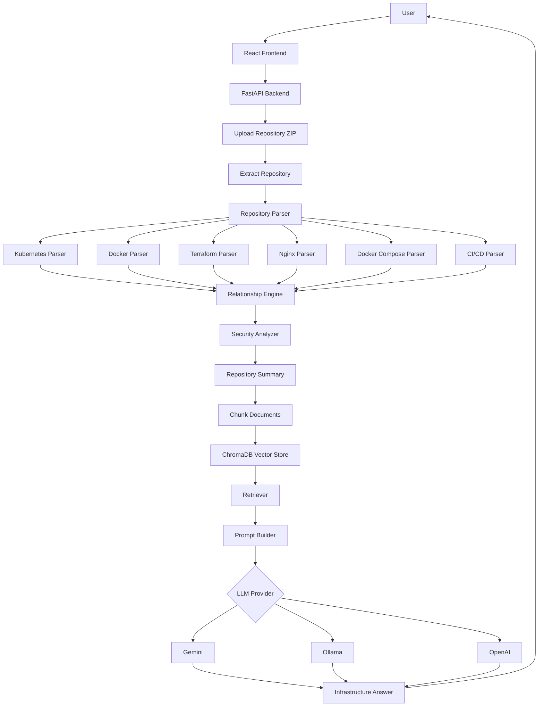

# System Architecture

```mermaid
flowchart TD

A[User]

A --> B[React Frontend]

B --> C[FastAPI Backend]

C --> D[Upload Repository ZIP]

D --> E[Extract Repository]

E --> F[Repository Parser]

F --> G[Kubernetes Parser]
F --> H[Docker Parser]
F --> I[Terraform Parser]
F --> J[Nginx Parser]
F --> K[Docker Compose Parser]
F --> L[CI/CD Parser]

G --> M[Relationship Engine]
H --> M
I --> M
J --> M
K --> M
L --> M

M --> N[Security Analyzer]

N --> O[Repository Summary]

O --> P[Chunk Documents]

P --> Q[ChromaDB Vector Store]

Q --> R[Retriever]

R --> S[Prompt Builder]

S --> T{LLM Provider}

T --> U[Gemini]
T --> V[Ollama]
T --> W[OpenAI]

U --> X[Infrastructure Answer]
V --> X
W --> X

X --> A
```